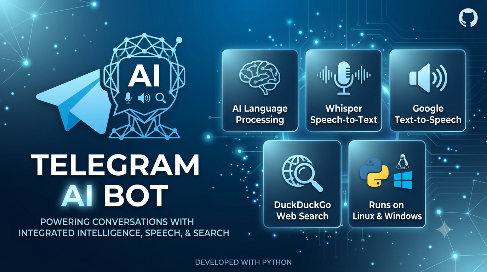

# 🤖 Ollama Telegram Bot v5.2

<p align="center">
  
  
  
  
  
</p>

<p align="center">
  <a href="https://github.com/USERNAME/REPO">
    
  </a>
</p>

<p align="center">
  
</p>

> **Trợ lý AI Telegram siêu tốc & đa năng:** Tích hợp Ollama (LLM Streaming + suy luận ẩn cho câu hỏi phức tạp), Vision OCR & Dịch thuật Ảnh/PDF, Voice hai chiều 100% local (faster-whisper + Piper TTS), trí nhớ dài hạn tự tóm tắt, 4 persona chọn được, Web Search thời gian thực có trích dẫn nguồn kèm link, SQLite Storage & UI Dashboard tương tác đa cấp.

---

## 🆕 Changelog v5.2 — Tư duy trả lời + Voice 100% Local

> Bản này thêm 2 module mới (`reasoning.py`, `local_voice.py`) và nâng cấp `database.py` (tự động `ALTER TABLE`, không mất dữ liệu cũ). Chi tiết từng bước tích hợp xem tại [`UPGRADE_GUIDE.md`](./UPGRADE_GUIDE.md).

| # | Hạng mục | Trước (v5.1) | Sau (v5.2) |
|---|---|---|---|
| 1 | 🧠 Tư duy trả lời | Trả lời thẳng, không phân loại độ khó | `reasoning.classify_complexity()` tự phân loại simple/medium/complex; câu hỏi phức tạp được ép suy luận từng bước trong khối ẩn `<suy_nghi>` trước khi trả lời — người dùng chỉ thấy câu trả lời cuối (`ThinkingStreamFilter` lọc khi stream) |
| 2 | 🎙️ STT (nghe giọng nói) | Groq Whisper (`whisper-large-v3`, cần internet + `GROQ_API_KEY`) | **faster-whisper** — chạy local (CPU/GPU), offline sau khi tải model lần đầu |
| 3 | 🗣️ TTS (đọc trả lời) | gTTS (cần internet) | **Piper TTS** — offline hoàn toàn, hỗ trợ nhiều giọng đọc, chọn qua `/voice` |
| 4 | 🧑‍🎭 Tính cách bot | 1 persona cố định (`SYSTEM_PROMPT_BASE`) | 4 preset (`ban_than`, `chuyen_gia`, `hai_huoc`, `co_van`), đổi bằng `/persona` |
| 5 | 🧠 Trí nhớ | Chỉ nhớ trong `MAX_HISTORY` cặp gần nhất | + hồ sơ trí nhớ dài hạn (`profile_summary`), tự tóm tắt lại mỗi N lượt chat bằng chính Ollama, không giới hạn theo cửa sổ history |
| 6 | 🔊 Độ dài trả lời Voice | Luôn ép cứng 1-2 câu | Co giãn theo độ phức tạp câu hỏi (1 câu → 4-6 câu) |

> ℹ️ Hàm STT/TTS cũ (Groq Whisper, gTTS) **vẫn được giữ trong `my_bot.py`** làm phương án dự phòng, không bắt buộc gỡ bỏ `GROQ_API_KEY`.

---

## 🩹 Changelog v5.1 — Bản vá lỗi & tối ưu

> Bản này rà soát toàn bộ mã nguồn v5.0, phát hiện và sửa các lỗi logic + lỗ hổng bảo mật sau:

| # | Loại | Vấn đề | Đã sửa |
|---|---|---|---|
| 1 | 🔴 Bảo mật | Menu "Quản trị Server" (CPU/RAM, danh sách file server) hiển thị và dùng được cho **mọi** user, không chỉ ADMIN | Gate `is_admin()` cho `menu_sys`, `sys_stats`, `sys_files`; ẩn nút khỏi menu chính nếu không phải admin |
| 2 | 🔴 Chức năng | `/weather` và `/news` gõ tay **không phản hồi gì** — logic nằm sai chỗ (trong `handle_text`, bị `filters.COMMAND` loại từ đầu) và chưa từng đăng ký `CommandHandler` | Tách thành `cmd_weather`/`cmd_news`, đăng ký `CommandHandler` đúng cách |
| 3 | 🟠 Logic | Cờ `force_concise` bị bật ngay cả khi tìm web thất bại (không có dữ liệu thật) | Chỉ bật khi thực sự có `web_context` |
| 4 | 🟠 Hiệu năng | Từ khóa tự-động-tìm-web quá rộng ("hôm nay", "hiện tại"...) khiến chat phiếm cũng bị tra Google/DuckDuckGo thừa | Tách nhóm từ khóa mạnh/yếu — từ khóa yếu chỉ trigger khi có dấu hiệu câu hỏi |
| 5 | 🟠 Ổn định | DuckDuckGo bị treo → `asyncio.wait_for` chỉ ngừng chờ chứ không hủy thật luồng nền, có thể tích lũy thread rác dùng chung pool với OCR/TTS/STT | Tách executor riêng, giới hạn 4 luồng cho search |
| 6 | 🟡 Bảo mật | Không có cảnh báo khi `ALLOWED_USERS` để trống (bot mở cho mọi người) | Log cảnh báo khi khởi động |
| 7 | 🟡 Audit | Lệnh `/shutdown`, `/reboot` không ghi log ai đã xác nhận | Thêm audit log khi thực thi |
| 8 | 🟡 Logic nhỏ | `list.copy()` shallow-copy khiến dict lịch sử bị mutate ngoài ý muốn trong pipeline voice | Tạo dict mới thay vì mutate |

---

## 🌟 Tính Năng Nổi Bật (Phiên bản v5.0)

- ⚡ **LLM Streaming Real-time:** Trả lời dạng chữ hiện dần từng phần (streamed responses) như ChatGPT, phản hồi tức thì qua Ollama HTTP API (`/api/chat`).
- 🔐 **Bảo mật & Cấu hình `.env`:** Nạp toàn bộ token, danh sách user được phép, admin, tham số hệ thống từ tệp `.env` — không hardcode secret trong code.
- 🗄️ **SQLite Storage Bền Vững:** Lưu trữ lịch sử hội thoại cá nhân, model đang chọn, biệt danh và cài đặt (auto-web, chế độ dịch...) vào CSDL SQLite (`bot_data.db`), không lo mất dữ liệu khi khởi động lại bot.
- 🌐 **Hạ Tầng Async HTTP (`httpx`):** Toàn bộ request ra ngoài (Ollama API, DuckDuckGo Search, Open-Meteo Weather, RSS News, Web Crawler) dùng `httpx.AsyncClient` không gây nghẽn event loop.
- 🔎 **Web Grounding + Trích dẫn nguồn có link (Anti-Hallucination):** Khi cần số liệu/tin mới, bot tự tra cứu DuckDuckGo và bóc tách nội dung bài viết, sau đó buộc LLM chỉ trả lời dựa trên dữ liệu tìm được, trích dẫn ngay trong câu bằng số **`[1]`, `[2]`...**. Cuối mỗi câu trả lời, bot **tự động** gắn thêm danh sách **📎 Nguồn tham khảo** với link bấm được, khớp đúng số thứ tự — không phụ thuộc vào việc LLM có nhớ chèn link hay không.
- 🖼️ **Vision & OCR (Trích Xuất & Dịch thuật Ảnh / PDF):** Tự nhận diện ngôn ngữ Anh/Việt trong hình ảnh (Tesseract OCR) và file PDF (`pypdf`), sau đó dịch tự động sang chiều còn lại (Google Translate).
- 🧠 **Suy luận ẩn cho câu hỏi phức tạp:** Bot tự phân loại độ khó câu hỏi (`reasoning.classify_complexity`); câu hỏi phức tạp (so sánh, phân tích, code, debug...) được ép "nghĩ" từng bước trong khối ẩn trước khi trả lời thật — người dùng chỉ thấy câu trả lời cuối cùng, không tốn thời gian suy luận cho chat phiếm.
- 🎭 **4 Persona chọn được (`/persona`):** Bạn thân, Chuyên gia, Dí dỏm, Cố vấn — đổi giọng văn/tính cách bot bất cứ lúc nào.
- 🧠 **Trí nhớ dài hạn tự tóm tắt:** Cứ mỗi N lượt chat (mặc định 10, chỉnh qua `LONG_TERM_MEMORY_EVERY_N_TURNS`), bot tự nén lịch sử gần đây thành một hồ sơ ngắn gọn về người dùng (sở thích, cách xưng hô, chủ đề hay hỏi...) bằng chính Ollama — không phụ thuộc cửa sổ `MAX_HISTORY`, không gọi API ngoài.
- 🎙️ **Voice hai chiều — 100% Local (STT & TTS):** Nghe tin nhắn thoại qua **faster-whisper** (chạy CPU/GPU, offline sau khi tải model lần đầu, không cần API key), xử lý bằng LLM rồi trả lời lại bằng cả text lẫn giọng nói qua **Piper TTS** (offline hoàn toàn, hỗ trợ nhiều giọng đọc tiếng Việt, chọn bằng `/voice`). Độ dài câu trả lời voice co giãn theo độ phức tạp câu hỏi. Nếu câu trả lời có kèm nguồn tham khảo, bot gửi thêm tin nhắn text riêng chứa link (vì voice không mang được link). *(Groq Whisper + gTTS vẫn được giữ trong code làm phương án dự phòng.)*
- 🎛️ **Dashboard Inline UI đa cấp (`/ui`):** Menu chọn model Ollama, Trung tâm Tiện ích (thời tiết, tin tức, dịch thuật, bật/tắt auto-web), và khu vực Quản trị Server (chỉ ADMIN).
- 🖥️ **Quản trị Server từ xa (chỉ ADMIN):** Xem CPU/RAM, ping Ollama, và `/shutdown` / `/reboot` server với bước xác nhận 2 lần để tránh bấm nhầm. *(v5.1: toàn bộ menu này — kể cả nút bấm và callback — nay đã được khóa chặt bằng `ADMIN_USER_IDS`, không còn hiển thị/dùng được cho user thường như bản v5.0.)*
- 🧑 **Ghi nhớ tên gọi riêng** cho từng người dùng, **xuất lịch sử hội thoại** ra file `.txt`, và **dừng phản hồi** đang tạo dở bằng `/stop`.
- 👥 **Hỗ trợ nhóm (Group Chat):** Trong group, bot chỉ trả lời khi được `@mention` hoặc reply trực tiếp (có thể tắt bằng `REQUIRE_MENTION_IN_GROUPS`).

---

## 🛠️ Yêu Cầu Hệ Thống

1. **Python:** 3.10+ (Khuyến nghị Python 3.11 hoặc 3.12)
2. **Ollama:** Đã cài đặt và đang chạy local (`ollama serve`) với mô hình sẵn có (VD: `llama3.1`, `qwen2.5:7b`, v.v.)
3. **Hệ thống Dependencies (Cài trên hệ điều hành):**
   - **FFmpeg:** Xử lý & chuyển đổi file âm thanh (`.ogg`, `.wav`, `.mp3`) — dùng cho cả voice local (faster-whisper/Piper).
   - **Tesseract OCR:** Trích chữ từ hình ảnh (cần package `tesseract-ocr` và ngôn ngữ `tesseract-ocr-eng` / `tesseract-ocr-vie`).
4. **Model giọng nói Piper** *(bắt buộc nếu muốn TTS local)*: tải 2 file `.onnx` + `.onnx.json` của 1 giọng tiếng Việt bất kỳ từ kho [`rhasspy/piper-voices`](https://huggingface.co/rhasspy/piper-voices) (thư mục `vi/vi_VN/`), đặt vào `./voices/` rồi khai báo qua `PIPER_VOICE_PATHS` trong `.env`. faster-whisper thì **không cần tải tay** — tự tải model vào cache khi chạy lần đầu.
5. **Groq API Key** *(tùy chọn, chỉ dùng làm fallback)*: kể từ v5.2, voice mặc định chạy local (faster-whisper); Groq Whisper chỉ còn là phương án dự phòng nếu bạn chủ động chuyển lại. Không có key vẫn chạy được mọi tính năng.

---

## 📦 Cài Đặt

### 1. Trên Linux (Ubuntu / Debian)

1. Sao chép mã nguồn vào thư mục dự án.
2. Cập nhật hệ thống và cài đặt các dependency:

```bash
sudo apt update
sudo apt install python3-full python3-pip ffmpeg -y
sudo apt install tesseract-ocr tesseract-ocr-eng
sudo apt-get install -y tesseract-ocr tesseract-ocr-vie
```

> 🎙️ Sau khi cài `requirements.txt` (bước dưới), tải model giọng Piper tiếng Việt (làm 1 lần) từ kho [`rhasspy/piper-voices`](https://huggingface.co/rhasspy/piper-voices) và đặt vào `./voices/` — xem chi tiết ở [`UPGRADE_GUIDE.md`](./UPGRADE_GUIDE.md#0-cài-thêm-thư-viện).

3. Tạo và kích hoạt môi trường ảo, cài thư viện, kiểm thử:

```bash
python3 -m venv venv
source venv/bin/activate
pip install -r requirements.txt
python3 my_bot.py
deactivate
```

### 2. Trên Windows

1. Cài đặt các công cụ cần thiết:

```powershell
# 1. Cài đặt Python
winget install --id Python.Python.3.11 -e

# 2. Cài đặt FFmpeg
winget install --id Gyan.FFmpeg -e

# 3. Cài đặt Tesseract OCR
winget install --id UB-Mannheim.TesseractOCR -e
```

2. Tạo môi trường ảo:

```powershell
python -m venv venv
Set-ExecutionPolicy Unrestricted -Scope Process
.\venv\Scripts\Activate.ps1
python.exe -m pip install --upgrade pip
pip install -r requirements.txt
```

3. Khởi chạy bot:

```powershell
python my_bot.py
```

---

## ⚙️ Cấu Hình `.env`

Sao chép `.env.example` thành `.env` rồi điền giá trị thật. Các biến chính:

| Biến | Bắt buộc | Mặc định | Mô tả |
|---|---|---|---|
| `TELEGRAM_TOKEN` | ✅ | — | Token bot lấy từ [@BotFather](https://t.me/BotFather) |
| `OLLAMA_BASE_URL` | ❌ | `http://localhost:11434` | Địa chỉ Ollama server |
| `OLLAMA_MODEL` | ❌ | `qwen2.5:7b` | Model mặc định cho hội thoại |
| `MAX_HISTORY` | ❌ | `25` | Số tin nhắn tối đa giữ trong ngữ cảnh mỗi user |
| `ALLOWED_USERS` | ❌ | *(trống = mọi người)* | Danh sách Telegram user ID được phép dùng bot, phân tách bởi dấu phẩy |
| `ADMIN_USER_IDS` | ❌ | *(trống = không ai)* | Danh sách user ID được phép dùng lệnh quản trị server |
| `RATE_LIMIT_SEC` | ❌ | `3` | Thời gian chờ tối thiểu giữa 2 tin nhắn của cùng 1 user |
| `DB_PATH` | ❌ | `bot_data.db` | Đường dẫn file SQLite |
| `LOG_FILE` | ❌ | `bot.log` | File log (tự xoay vòng, tối đa 5MB × 3 bản) |
| `MAX_UPLOAD_MB` | ❌ | `15` | Giới hạn dung lượng file/ảnh tải lên |
| `REQUIRE_MENTION_IN_GROUPS` | ❌ | `true` | Chỉ trả lời khi được `@mention`/reply trong group chat |
| `OLLAMA_TIMEOUT_SEC` | ❌ | `120` | Timeout gọi Ollama |
| `OLLAMA_RETRY_ATTEMPTS` | ❌ | `2` | Số lần thử lại khi gọi Ollama thất bại |
| `GROQ_API_KEY` | ❌ *(fallback voice)* | — | API key Groq, chỉ cần nếu muốn dùng lại STT Whisper qua Groq thay vì local |
| `FASTER_WHISPER_MODEL` | ❌ | `small` | Model faster-whisper cho STT local (`tiny`/`base`/`small`/`medium`/`large-v3`, hoặc path model đã tải sẵn) |
| `FASTER_WHISPER_DEVICE` | ❌ | `cpu` | Thiết bị chạy faster-whisper (`cpu` \| `cuda`) |
| `FASTER_WHISPER_COMPUTE` | ❌ | `int8` | Kiểu tính toán (`int8` nhẹ cho CPU, `float16` cho GPU) |
| `PIPER_VOICE_PATHS` | ❌ *(cần cho TTS local)* | — | Danh sách giọng Piper, dạng `tên:đường_dẫn.onnx`, phân tách bởi dấu phẩy — vd `nu:./voices/vi_VN-vais1000-medium.onnx,nam:./voices/vi_VN-25hours_single-low.onnx` |
| `PIPER_DEFAULT_VOICE` | ❌ | *(giọng đầu tiên trong `PIPER_VOICE_PATHS`)* | Tên giọng Piper mặc định khi user chưa chọn qua `/voice` |
| `LONG_TERM_MEMORY_EVERY_N_TURNS` | ❌ | `10` | Số lượt chat giữa 2 lần tự tóm tắt hồ sơ trí nhớ dài hạn |
| `OCR_LANG` | ❌ | `eng+vie` | Gói ngôn ngữ Tesseract dùng cho OCR |
| `STREAM_EDIT_INTERVAL` | ❌ | `0.7` | Khoảng cách (giây) giữa 2 lần edit tin nhắn khi streaming |

---

## 🚀 Khởi Chạy Bot

### 1. Chạy Trực Tiếp

```bash
# Kích hoạt venv nếu chưa kích hoạt
source venv/bin/activate  # Trên Linux/macOS
# Khởi chạy bot
python my_bot.py
```

### 2. Chạy dưới dạng Dịch Vụ Systemd (Linux - Khuyến nghị)

Tạo file dịch vụ `/etc/systemd/system/telegram-bot.service`:

```ini
[Unit]
Description=Telegram AI Bot
After=network.target

[Service]
Type=simple
WorkingDirectory=/home/cwng/Documents/GitHub/chatAi_bots
ExecStart=/home/cwng/Documents/GitHub/chatAi_bots/venv/bin/python3 /home/cwng/Documents/GitHub/chatAi_bots/my_bot.py
Restart=on-failure
RestartSec=5
StandardOutput=journal
StandardError=journal

[Install]
WantedBy=multi-user.target
```

Kích hoạt và khởi động dịch vụ:

```bash
sudo systemctl daemon-reload
sudo systemctl enable telegram-bot.service
sudo systemctl start telegram-bot.service
sudo systemctl status telegram-bot.service
sudo systemctl restart telegram-bot.service
```

### 3. Chạy dưới dạng Dịch Vụ Windows Service (NSSM - Khuyến nghị)

1. Trỏ về đúng thư mục dự án:

```powershell
cd C:\Users\ngcwn\OneDrive\Documents\GitHub\chatAi_bots\win
```

2. Gọi lệnh cài đặt Service:

```powershell
.\nssm.exe install TelegramBotService
```

3. Điền bảng thông số NSSM GUI. Một cửa sổ bảng điều khiển NSSM sẽ bật lên, điền chính xác từng mục:

- **Tab 1 — Path:** Nhấp `...` và trỏ đến đúng file `python.exe` trong môi trường ảo:
  ```powershell
  C:\Users\ngcwn\OneDrive\Documents\GitHub\chatAi_bots\venv\Scripts\python.exe
  ```
- **Tab 2 — Startup directory:** Trỏ đến thư mục chứa code:
  ```powershell
  C:\Users\ngcwn\OneDrive\Documents\GitHub\chatAi_bots
  ```
- **Tab 3 — Arguments:** Điền tên file chính:
  ```powershell
  my_bot.py
  ```

4. Khởi chạy và kiểm tra Service:

```powershell
.\nssm.exe start TelegramBotService
```

Các lệnh quản lý Bot tiện lợi về sau (chạy trên PowerShell Admin):

```powershell
.\nssm.exe status TelegramBotService
.\nssm.exe restart TelegramBotService
.\nssm.exe stop TelegramBotService
.\nssm.exe remove TelegramBotService confirm
```

---

## 🎮 Lệnh & Hướng Dẫn Sử Dụng

### 📜 Danh Sách Lệnh (`/commands`)

| Lệnh | Mô tả |
|---|---|
| `/start` | Khởi động bot và hiển thị lời chào |
| `/help` | Xem hướng dẫn sử dụng đầy đủ |
| `/ui` | Mở Dashboard UI đa cấp (chọn model, tiện ích, quản trị) |
| `/weather <thành phố>` | Tra cứu thời tiết hiện tại + chất lượng không khí (PM2.5) |
| `/news [nguồn]` | Điểm tin nhanh — `vnexpress` (mặc định), `tuoitre`, `thanhnien`, `dantri`, `bbcvietnamese` |
| `/nickname <tên>` | Đặt tên gọi riêng để bot xưng hô gần gũi hơn |
| `/persona <tên>` | Đổi tính cách/giọng văn bot — `ban_than`, `chuyen_gia`, `hai_huoc`, `co_van` |
| `/voice <tên>` | Đổi giọng đọc Piper khi bot trả lời bằng voice (xem danh sách qua `PIPER_VOICE_PATHS`) |
| `/export` | Xuất toàn bộ lịch sử hội thoại ra file `.txt` |
| `/stop` | Dừng phản hồi AI đang tạo dở giữa chừng |
| `/reset` | Xóa sạch lịch sử hội thoại cá nhân trong CSDL |
| `/autoweb` | Bật/tắt tự động tra cứu web thời gian thực cho **mọi** tin nhắn (chữ + thoại) |
| `/ping` | Kiểm tra tình trạng kết nối tới Ollama |
| `/shutdown` | *[Admin]* Tắt nguồn server — cần xác nhận 2 bước |
| `/reboot` | *[Admin]* Khởi động lại server — cần xác nhận 2 bước |

> 💡 Nếu không bật `/autoweb`, bot vẫn tự động tra web khi câu hỏi chứa các từ khóa như "giá vàng", "tỷ giá", "mới nhất", "bây giờ", "hôm nay".

### 💡 Các Chức Năng Tương Tác Trực Tiếp

1. **Trò chuyện Chữ (Text Streaming):** Nhập câu hỏi bất kỳ, bot trả lời và hiển thị từng chữ hiện dần real-time giống ChatGPT, giữ ngữ cảnh hội thoại theo từng người dùng. Câu hỏi phức tạp sẽ được bot "nghĩ" ẩn trước khi trả lời (không hiện ra màn hình).
2. **Gửi Giọng Nói (Voice Notes):** Gửi tin nhắn thoại, bot chuyển thành văn bản bằng **faster-whisper (local, offline)**, AI xử lý và trả lời lại bằng cả tin nhắn thoại (**Piper TTS, local**) lẫn văn bản. Độ dài câu trả lời voice co giãn theo độ phức tạp câu hỏi.
3. **Gửi Ảnh / File PDF (OCR & Dịch):** Gửi ảnh hoặc PDF chứa chữ tiếng Anh hoặc tiếng Việt, bot tự nhận diện ngôn ngữ, OCR và dịch sang chiều còn lại.
4. **Trích dẫn nguồn khi tra web:** Khi câu trả lời dựa trên dữ liệu tìm kiếm, bot chèn số thứ tự `[1]`, `[2]`... ngay trong câu, và tự động thêm khối **📎 Nguồn tham khảo** với link bấm được ở cuối tin nhắn để người dùng kiểm chứng.
5. **Đổi tính cách & giọng đọc:** Dùng `/persona` để đổi giọng văn bot (bạn thân/chuyên gia/dí dỏm/cố vấn), `/voice` để đổi giọng đọc Piper khi trả lời bằng voice.
6. **Trí nhớ dài hạn:** Sau một số lượt chat nhất định, bot tự tóm tắt lại "hồ sơ" về người dùng (sở thích, cách xưng hô, chủ đề hay hỏi) để trả lời gần gũi và đúng ngữ cảnh hơn ở các lần trò chuyện sau, kể cả sau khi lịch sử ngắn hạn đã bị xóa bớt.
7. **Dashboard `/ui`:** Menu đa cấp cho phép đổi model Ollama đang dùng, mở Trung tâm Tiện ích (thời tiết theo thành phố có sẵn, tin tức theo nguồn, dịch văn bản 2 chiều Anh↔Việt, bật/tắt auto-web), và khu Quản trị Server dành riêng cho ADMIN (xem CPU/RAM, ping Ollama, reboot/shutdown có xác nhận).

---

## 🏗️ Cấu Trúc Dự Án

```text
.
bot/
├── my_bot.py            # Entrypoint — chạy: python my_bot.py
├── config.py             # Toàn bộ hằng số + biến môi trường (.env)
├── bot_logger.py          # Logging tập trung (console + file xoay vòng)
├── utils.py                # Helper dùng chung: quyền, rate-limit, safe_reply, lock...
├── llm_engine.py            # Giao tiếp Ollama: build prompt, chat, streaming
├── database.py               # SQLite (giữ nguyên)
├── reasoning.py                # Suy luận ẩn, persona, trí nhớ dài hạn (giữ nguyên)
├── local_voice.py               # STT/TTS local — faster-whisper + Piper (giữ nguyên)
│
├── skills/                       # Tính năng độc lập, KHÔNG import telegram
│   ├── weather.py                  # Thời tiết + AQI (open-meteo)
│   ├── news.py                      # Tin tức RSS
│   ├── ocr.py                        # OCR ảnh/PDF + dịch 2 chiều
│   ├── web_search.py                  # DuckDuckGo search + cào nội dung (RAG)
│   ├── voice.py                        # STT (local/Groq) + TTS reply
│   └── dashboard.py                     # Sysadmin: CPU/RAM, ping, shutdown/reboot
│
├── handlers/                       # Cầu nối Telegram Update ↔ skills/
│   ├── commands.py                   # Toàn bộ /command (trừ /ui, callback)
│   ├── text_handler.py                # handle_text — chat streaming chính
│   ├── voice_handler.py                # handle_voice — nhận voice note
│   ├── media_handler.py                 # handle_media — ảnh/PDF
│   └── dashboard_handler.py              # Inline keyboard UI + callback_query
│
├── data/       # bot_data.db (SQLite) — gitignored
├── voices/      # File giọng Piper (.onnx) — gitignored
├── models/       # Model faster-whisper tải sẵn (tùy chọn)
├── logs/          # bot.log xoay vòng — gitignored
│
├── .env.example    # Mẫu biến môi trường
├── .gitignore
└── requirements.txt
```

---

## 📝 Giấy Phép

Dự án phát triển dưới giấy phép **MIT License**. Mọi đóng góp và Pull Request đều được hoan nghênh!