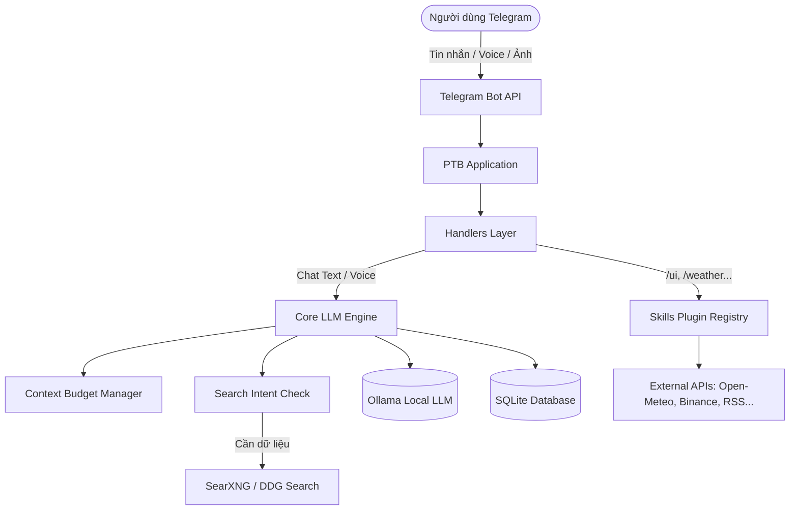

# Kiến Trúc Hệ Thống `my_bot`

## 1. Tổng Quan

`my_bot` là một trợ lý AI đa chức năng chạy trên Telegram, được xây dựng theo mô hình module hóa cao độ, giao tiếp trực tiếp với mô hình ngôn ngữ lớn (LLM) cục bộ thông qua **Ollama** hoặc các cloud API (Groq).

## 2. Cấu Trúc Thư Mục Chuẩn (`src/` Layout)

```text
my_bot_restructured/
├── src/
│   ├── __init__.py          # Package metadata & version
│   ├── __main__.py          # Hỗ trợ chạy: python -m main
│   ├── main.py              # Entrypoint khởi tạo bot & đăng ký handlers
│   ├── config.py            # Quản lý cấu hình & biến môi trường
│   ├── core/                # Các thành phần lõi
│   │   ├── logger.py        # Logging xoay vòng tập trung
│   │   ├── database.py      # SQLite async storage (aiosqlite)
│   │   ├── llm_engine.py    # Giao tiếp Ollama, streaming, intent filter
│   │   ├── reasoning.py     # Suy luận ẩn, personas, long-term memory
│   │   ├── context_manager.py # Quản lý Token budget & sliding window
│   │   ├── tencent_memory.py  # Bộ nhớ đa tầng TencentDB Agent Memory
│   │   ├── local_voice.py   # Voicebox STT & Piper TTS
│   │   └── utils.py         # Phân quyền, rate limit, locks
│   ├── handlers/            # Tiếp nhận & điều phối Telegram Updates
│   │   ├── commands.py      # Lệnh /start, /help, /weather, /news...
│   │   ├── text_handler.py  # Chat văn bản & RAG streaming
│   │   ├── voice_handler.py # Xử lý voice note & phản hồi giọng nói
│   │   ├── media_handler.py # OCR trích chữ & dịch thuật ảnh/PDF
│   │   └── dashboard_handler.py # Giao diện nút bấm /ui
│   ├── skills/              # Hệ thống tính năng Plug & Play (BaseSkill)
│   │   ├── base.py          # Lớp cơ sở BaseSkill & SkillResult
│   │   ├── registry.py      # Tự động nạp (auto-discover) skills
│   │   ├── weather.py       # Thời tiết & AQI (Open-Meteo)
│   │   ├── news.py          # Tin tức RSS
│   │   ├── web_search.py    # Tìm kiếm internet đa tầng (SearXNG / DDG)
│   │   ├── ocr.py           # OCR & dịch thuật
│   │   ├── voice.py         # Điều phối STT/TTS
│   │   ├── voicebox_client.py # Client kết nối Voicebox Docker
│   │   ├── dashboard.py     # Giám sát tài nguyên phần cứng
│   │   ├── document_exporter.py # Xuất tệp Excel & Word
│   │   ├── pdf_report.py    # Tạo báo cáo nghiên cứu AI PDF (ReportLab)
│   │   └── skills_module/   # Thư mục chứa các module kỹ năng mở rộng (crypto...)
│   │       ├── __init__.py
│   │       └── crypto.py    # Tra cứu giá tiền mã hoá (Binance)
│   └── webapp/              # Trạm Điều Khiển Web (FastAPI)
│       ├── main.py          # API & Web dashboard read-only
│       └── static/          # Frontend giao diện người dùng
├── tests/                   # Bộ kiểm thử tự động
├── docs/                    # Tài liệu hướng dẫn
├── scripts/                 # Script dịch vụ systemd & Windows NSSM
├── pyproject.toml           # Cấu hình gói và dependencies chuẩn PEP 621
├── Dockerfile               # Docker build container
└── docker-compose.yml       # Điều phối đa dịch vụ
```

## 3. Luồng Xử Lý Dữ Liệu (Data Flow)



## 4. Cơ Chế Plug & Play của Skills

Mỗi skill kế thừa từ `BaseSkill`:
1. Định nghĩa `name`, `display_name`, `description`, `command` và `parameters_schema`.
2. Khi đặt file vào `src/skills/` hoặc `src/skills/skills_module/`, `SkillRegistry.auto_discover()` sẽ tự động nạp mà không cần sửa code lõi.
3. Bot tự động liên kết lệnh `/tên_lệnh` trên Telegram tới skill tương ứng.

