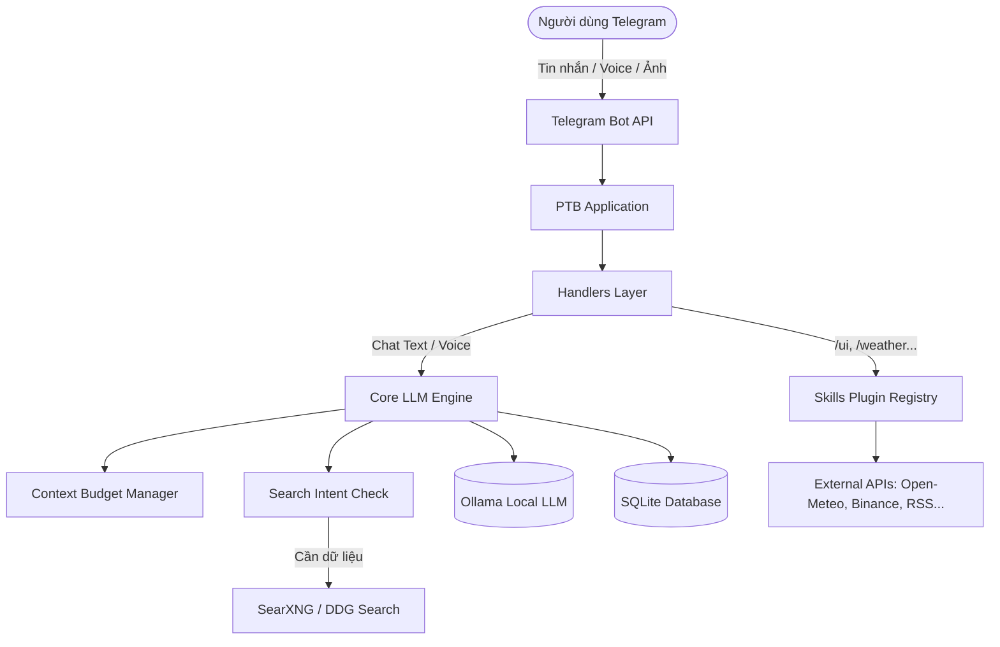

# Kiến Trúc Hệ Thống `my_bot`

## 1. Tổng Quan

`my_bot` là một trợ lý AI đa chức năng chạy trên Telegram, được xây dựng theo mô hình module hóa cao độ, giao tiếp trực tiếp với mô hình ngôn ngữ lớn (LLM) cục bộ thông qua **Ollama** hoặc các cloud API (Groq).

## 2. Cấu Trúc Thư Mục Chuẩn (`src/` Layout)


```text
my_bot/
├── README.md
├── LICENSE
├── pyproject.toml              # PEP 621, package my_bot, CLI my-bot / my-bot-web
├── requirements.txt            # đồng bộ với pyproject dependencies
├── .env.example
├── .gitignore
├── Dockerfile                  # python:3.11-slim + tesseract + ffmpeg
├── Dockerfile.webapp           # image nhẹ hơn nếu tách; hoặc cùng image khác CMD
├── docker-compose.yml          # bot + webapp + searxng + voicebox
├── docker-compose.webapp.yml   # webapp độc lập (Linux host network)
├── src/my_bot/
│   ├── __init__.py             # __version__
│   ├── __main__.py             # python -m my_bot
│   ├── main.py                 # PTB Application
│   ├── config.py
│   ├── core/
│   │   ├── logger.py
│   │   ├── database.py
│   │   ├── llm_engine.py
│   │   ├── reasoning.py
│   │   ├── context_manager.py
│   │   ├── tencent_memory.py   # optional cloud memory; tắt nếu thiếu env
│   │   ├── local_voice.py
│   │   └── utils.py
│   ├── handlers/
│   │   ├── commands.py
│   │   ├── text_handler.py
│   │   ├── voice_handler.py
│   │   ├── media_handler.py
│   │   └── dashboard_handler.py
│   ├── skills/
│   │   ├── base.py
│   │   ├── registry.py
│   │   ├── weather.py
│   │   ├── news.py
│   │   ├── web_search.py
│   │   ├── ocr.py
│   │   ├── voice.py
│   │   ├── voicebox_client.py
│   │   ├── dashboard.py
│   │   ├── document_exporter.py
│   │   ├── pdf_report.py
│   │   └── extra/
│   │       └── crypto.py
│   └── webapp/
│       ├── main.py
│       └── static/
│           ├── index.html
│           ├── app.js
│           └── style.css
├── tests/
├── scripts/
│   ├── install.sh              # ROOT=$(cd ..) từ scripts, hoặc ROOT=$(git rev-parse)
│   ├── uninstall.sh
│   └── systemd/my_bot.service
├── searxng/
│   └── settings.yml            # bắt buộc formats: [html, json]
├── data/                       # runtime, gitkeep
├── logs/
├── fonts/                      # NotoSans Regular + Bold cho PDF tiếng Việt
└── voices/                     # Piper .onnx + .onnx.json
```

## 3. Kiến trúc mục tiêu

```text
                    ┌─────────────┐     ┌──────────────┐
  Telegram User ───►│ Bot process │────►│ Ollama :11434│
                    │  (PTB)      │     └──────────────┘
                    │             │     ┌──────────────┐
                    │  handlers ──┼────►│ SearXNG :8081│
                    │  skills ────┼────►│ Voicebox STT │
                    │  core/llm ──┤     └──────────────┘
                    │             │     ┌──────────────┐
                    └──────┬──────┘     │ SQLite WAL   │
                           │            │ data/bot.db  │
                    ┌──────▼──────┐     └──────────────┘
                    │ WebApp      │  read-only, process riêng
                    │ FastAPI     │  :8080
                    └─────────────┘
```

## 4. Luồng Xử Lý Dữ Liệu (Data Flow)


```mermaid
flowchart TD
    User([Người dùng Telegram]) -->|Tin nhắn / Voice / Ảnh| TelegramAPI[Telegram Bot API]
    TelegramAPI --> Updater[PTB Application]
    Updater --> Handlers[Handlers Layer]
    
    Handlers -->|/ui, /weather...| Skills[Skills Plugin Registry]
    Handlers -->|Chat Text / Voice| LLMEngine[Core LLM Engine]
    
    LLMEngine --> ContextMgr[Context Budget Manager]
    LLMEngine --> IntentCheck[Search Intent Check]
    IntentCheck -->|Cần dữ liệu| WebSearch[SearXNG / DDG Search]
    
    LLMEngine --> Ollama[(Ollama Local LLM)]
    LLMEngine --> Database[(SQLite Database)]
    
    Skills --> Services[External APIs: Open-Meteo, Binance, RSS...]
```

## 4. Cơ Chế Plug & Play của Skills

Mỗi skill kế thừa từ `BaseSkill`:
1. Định nghĩa `name`, `display_name`, `description`, `command` và `parameters_schema`.
2. Khi đặt file vào `src/skills/` hoặc `src/skills/skills_module/`, `SkillRegistry.auto_discover()` sẽ tự động nạp mà không cần sửa code lõi.
3. Bot tự động liên kết lệnh `/tên_lệnh` trên Telegram tới skill tương ứng.

